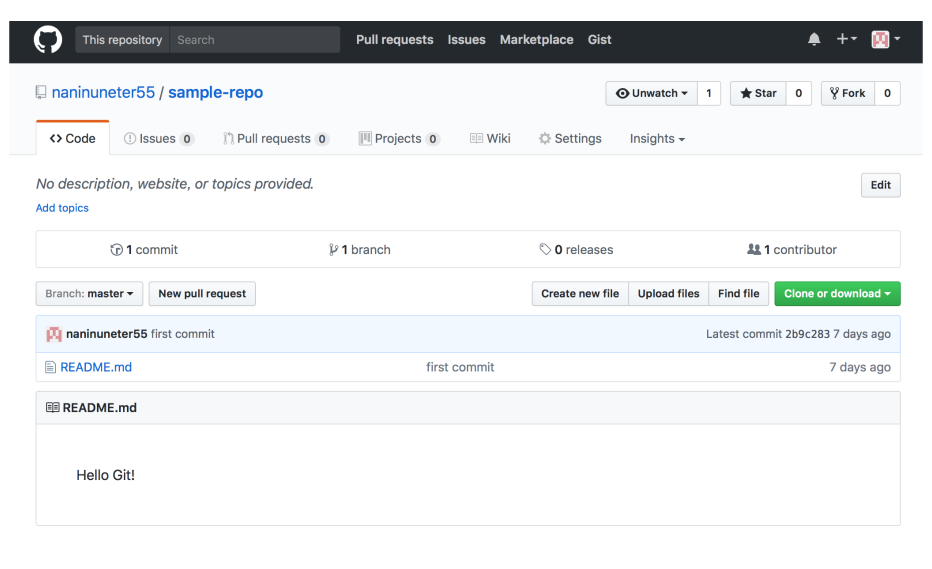
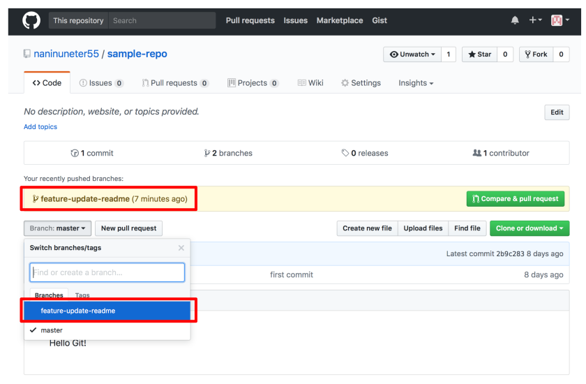
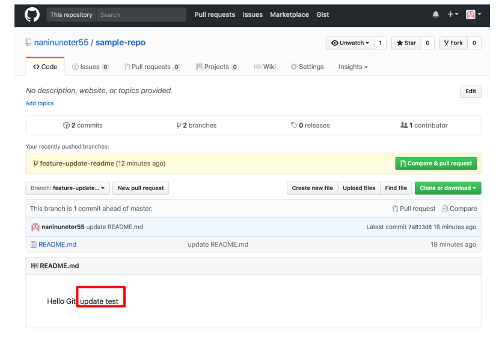

=========================
GitHubの技
=========================

GiHubとは
==============

GitHubは、Gitの仕組みを利用して、世界中の人々がプログラムコードやデザインデータなどの
自分の作品を保存、公開することができるようにしたウェブサービスの名称。

「フォーク」「プルリクエスト」「マージ」の3つの機能があることによって、
GitHubが人気の高いサービスとして支持されています。

フォーク

   食器のフォークの先端のように、一つのプロジェクトが複数に分派していくことを言います。
   GitHubでは、誰かのリポジトリをほかの人がコピーすることによって行います。
   オリジナルのものに対する編集アクセス権がなくても、それを自分のところで改変することができます。

プルリクエスト

   自分が行った変更をオリジナルのものに反映したい時に使います。
   オリジナルのオーナーに「プルリクエスト」と呼ばれる通知を送ることができます。

マージ

   プルリクエストを受け取ったオーナーは、ボタンをクリックするだけで、
   リポジトリに対して行われた変更を自分のリポジトリにも取り入れることができます。
   人のコードを自分のコードに導入することを、「マージする」と言います。
   マージは、複数の開発者が関わるプロジェクトにおいて最重要な工程であり、
   GitHubではそれが安全確実迅速に行うことができます。

GitHubアカウントの開設
=============================================

GitHubにアカウントを持っていない場合は以下のサイトを参照にアカウントを登録します。
`Githubのアカウント作成方法 - Qiita <http://qiita.com/rshibasa/items/f62db870ed573ca4dced>`_

GitHub利用の流れ
==================================

#. リーダ：リモートリポジトリを作成する
#. リーダ：マスターブランチにファイルを登録する
#. メンバー：リモートリポジトリをクローンする
#. メンバー：ブランチを切る
#. メンバー：ファイルを修正する
#. メンバー：ローカルリポジトリにコミットする
#. メンバー：リモートリポジトリにプッシュする
#. メンバー：プルリクを送信する
#. リーダ：レビューを実施し、プルリクを差戻す
#. メンバー：ファイルを修正し、コミット＆プッシュをする
#. リーダ：レビューを実施し、プルリクを承認する
#. リーダ：ブランチをマスターブランチにマージする

リモートリポジトリを作成する（リーダ）
^^^^^^^^^^^^^^^^^^^^^^^^^^^^^^^^^^^^^^^^^^^^^

#. GitHubのダッシュボード画面の右上「+」ボタンから「New repository」を選択します。

   .. figure:: images/GitHub_new_repo_メニュー選択.svg
      :width: 100%
      :align: center

      GitHub New repository メニュー選択

#. 「Repository Name」欄にリポジトリ名を入力し、
   「Initialize this repository with a README」のチェックを外して、
   「Create Repository」ボタンをクリックします。

   .. figure:: images/GitHub_new_repo_create.svg
      :width: 100%
      :align: center

      GitHub New repository 作成画面

#. 完了画面が表示されます。
   この画面で表示されている git remote add の箇所は後工程で使用しますので、
   クリップボードまたは任意のテキストファイルにコピーしておいてください。

   .. figure:: images/GitHub_new_repo_完了.svg
      :width: 100%
      :align: center

      GitHub New repository 完了画面

マスターブランチにファイルを登録する（リーダ）
^^^^^^^^^^^^^^^^^^^^^^^^^^^^^^^^^^^^^^^^^^^^^^^^^^^^^^^^^^

:doc:`git` で作成したsample-repoリポジトリをGitHubに登録します。

git remote add コマンドで origin という名前でリモートリポジトリを参照できるように
設定します。前節でコピーしておいた git remote add コマンドを実行してください。

   .. code-block:: bash

      $ git remote add origin https://github.com/naninuneter55/sample-repo.git

次に git push コマンドで origin という名前で参照できるようにしたリモートリポジトリに
masterブランチを登録します。

.. code-block:: bash

   $ git push -u origin master
   Counting objects: 3, done.
   Writing objects: 100% (3/3), 227 bytes | 0 bytes/s, done.
   Total 3 (delta 0), reused 0 (delta 0)
   To https://github.com/naninuneter55/sample-repo.git
    * [new branch]      master -> master
   Branch master set up to track remote branch master from origin.

-uオプション（--set-upstreamと同意）を付けると、プッシュの処理と同時に該当するブランチの
デフォルトリモートが変更されます。害にはならないのでgit pushには-uオプションを付けましょう。

GitHubでリモートリポジトリを作成した画面をリロードしてみてください。
ロカールリポジトリの内容がリモートリポジトリに反映されていることがわかります。

   GitHub git push 後の画面

リモートリポジトリをクローンする（メンバー）
^^^^^^^^^^^^^^^^^^^^^^^^^^^^^^^^^^^^^^^^^^^^^

git cloneコマンドを利用して、リーダが作成したリモートリポジトリを
メンバーのローカルリポジトリとして取得することができます。

.. code-block:: bash

   $ git clone <リモートリポジトリのURL>

.. code-block:: bash

   $ git clone https://github.com/naninuneter55/sample-repo.git
   Cloning into 'sample-repo'...
   remote: Counting objects: 3, done.
   remote: Total 3 (delta 0), reused 3 (delta 0), pack-reused 0
   Unpacking objects: 100% (3/3), done.

ブランチを切る（メンバー）
^^^^^^^^^^^^^^^^^^^^^^^^^^^^^^^^^^^^^^^^^^^^^

git cloneコマンドで取得したローカルリポジトリは、masterブランチを利用しています。
現在どのブランチを利用しているかはgit branchコマンドで確認できます。

.. code-block:: bash

   $ git branch
   * master

何か修正を加える場合はブランチ（枝）を作って、最後にリモートリポジトリ（GitHub）の
masterブランチに合体するというやり方が安全かつ効率的です。

git branchコマンドを利用してfeature-update-readmeというブランチを切り、
git checkoutコマンドで作成したブランチへの切り替えを行いましょう。

.. code-block:: bash

   $ git branch feature-update-readme
   $ git branch
     feature-update-readme
   * master
   $ git checkout feature-update-readme
   Switched to branch 'feature-update-readme'
   $ git branch
   * feature-update-readme
     master

ファイルを修正する（メンバー）
^^^^^^^^^^^^^^^^^^^^^^^^^^^^^^^^^^^^^^^^^^^^^

ロカールリポジトリのREADME.mdファイルを更新しましょう。

.. code-block:: bash

   $ echo 'update test' >> README.md
   $ cat README.md
   Hello Git!
   update test

ローカルリポジトリにコミットする（メンバー）
^^^^^^^^^^^^^^^^^^^^^^^^^^^^^^^^^^^^^^^^^^^^^

git addコマンドとgit commitコマンドを利用してローカルリポジトリにコミットします。

.. code-block:: bash

   $ git add .
   $ git commit -m "update README.md"
   [feature-update-readme 7a813d8] update README.md
    1 file changed, 1 insertion(+)

リモートリポジトリにプッシュする（メンバー）
^^^^^^^^^^^^^^^^^^^^^^^^^^^^^^^^^^^^^^^^^^^^^

git pushコマンドを利用して、ローカルリポジトリの内容をリモートリポジトリ（GitHub）に
反映させます。

.. code-block:: bash

   $ git push -u origin <ブランチ名>

.. code-block:: bash

   $ git push -u origin feature-update-readme
   Counting objects: 3, done.
   Writing objects: 100% (3/3), 277 bytes | 0 bytes/s, done.
   Total 3 (delta 0), reused 0 (delta 0)
   To https://github.com/naninuneter55/sample-repo.git
    * [new branch]      feature-update-readme -> feature-update-readme
   Branch feature-update-readme set up to track remote branch feature-update-readme from origin.

git cloneコマンドでロカールリポジトリを作成しているので、
originにはリモートリポジトリの情報が設定されています。

.. code-block:: bash

   $ git remote -v
   origin	https://github.com/naninuneter55/sample-repo.git (fetch)
   origin	https://github.com/naninuneter55/sample-repo.git (push)

feature-update-readmeブランチがリモートリポジトリ（GitHub）に登録されたかブラウザから
確認してみましょう。

   GitHub git push <ブランチ> 後の画面

   GitHub README修正確認

プルリクを送信する（メンバー）
^^^^^^^^^^^^^^^^^^^^^^^^^^^^^^^^^^^^^^^^^^^^^

レビューを実施し、プルリクを差戻す（リーダ）
^^^^^^^^^^^^^^^^^^^^^^^^^^^^^^^^^^^^^^^^^^^^^^^^^^^^^^^^^^^^^^^^^^^^^^

ファイルを修正し、コミット＆プッシュをする（メンバー）
^^^^^^^^^^^^^^^^^^^^^^^^^^^^^^^^^^^^^^^^^^^^^^^^^^^^^^^^^

レビューを実施し、プルリクを承認する（リーダ）
^^^^^^^^^^^^^^^^^^^^^^^^^^^^^^^^^^^^^^^^^^^^^^^^^^^^^^^^^^^^

ブランチをマスターブランチにマージする（リーダ）
^^^^^^^^^^^^^^^^^^^^^^^^^^^^^^^^^^^^^^^^^^^^^^^^^^^^^^^^^^^
